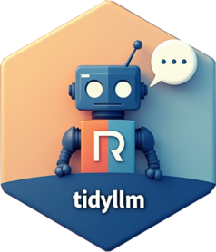

# tidyllm <a href="https://edubruell.github.io/tidyllm/"></a>

[](https://opensource.org/licenses/MIT)
[](https://cran.r-project.org/package=tidyllm)


**tidyllm** is an R package for working with large language model APIs in data analysis workflows. It supports **Anthropic Claude**, **OpenAI**, **Google Gemini**, **Mistral**, **Groq**, **DeepSeek**, **OpenRouter**, local models via **Ollama** and **llama.cpp**, and more, all through a single consistent interface.

## Features

- **Multiple providers**: Switch between cloud and local models using the same verb + provider pattern.
- **Unified media system**: Send images, audio, video, and PDFs to any provider that supports them via `.media`. Upload files to provider servers for reuse via `.files` and `upload_file()`.
- **Interactive message history**: Manage multi-turn conversations with structured history automatically formatted for each API.
- **Batch processing**: Handle large workloads with Anthropic, OpenAI, Mistral, Groq, and Gemini batch APIs, reducing costs by up to 50%.
- **Tidy workflow**: Pipeline-oriented, side-effect-free design that integrates naturally with tidyverse data workflows.


## Installation

To install **tidyllm** from CRAN, use:

```r
install.packages("tidyllm")
```

Or for the development version from GitHub:
```r
devtools::install_github("edubruell/tidyllm")
```

## Basic Example

```r
library(tidyllm)

# Describe an image with Claude, continue with a local model
conversation <- llm_message("Describe this image.",
                             .media = img("photo.jpg")) |>
  chat(claude())

conversation |>
  llm_message("Based on that description, what research topic could this figure relate to?") |>
  chat(ollama(.model = "qwen3.5:4b"))
```

For more examples and advanced usage, see the [Get Started vignette](https://edubruell.github.io/tidyllm/articles/tidyllm.html).

Please note: To use **tidyllm** you need either a local Ollama or llama.cpp installation, or an active API key for one of the supported cloud providers. See the [Get Started vignette](https://edubruell.github.io/tidyllm/articles/tidyllm.html) for setup instructions.

## What's new in 0.7.0

**Find out what a provider supports.** `provider_capabilities()` returns a tibble of the verbs, arguments and defaults each provider accepts, or, with `.what = "media"`, which media types it takes:

```r
provider_capabilities(.argument = ".thinking")
provider_capabilities(.what = "media")
```

**Use your own Claude CLI.** `claude_cli()` runs the `claude` command line tool already installed and signed in on your machine. There is no API key, and the CLI's built-in tools are off unless you allow them with `.cli_tools`:

```r
llm_message("Explain what a tibble is in one sentence.") |>
  chat(claude_cli())
```

**Web search for any model.** `websearch_tool()` gives any model that supports tools a search tool, including local Ollama models. It uses Tavily (needs `TAVILY_API_KEY`) or a SearXNG server; `websearch()` runs the same search directly and returns a tibble:

```r
llm_message("What changed in the latest R release?") |>
  chat(ollama(), .tools = websearch_tool())

websearch("R release notes", .max_results = 3)
```

Read the [Changelog](https://edubruell.github.io/tidyllm/news/) for the full list of changes.

## Learn More

- [Get Started with tidyllm](https://edubruell.github.io/tidyllm/articles/tidyllm.html)
- [Changelog](https://edubruell.github.io/tidyllm/news/)
- [Documentation](https://edubruell.github.io/tidyllm/)
- Use-case oriented articles:
  - [Classifying Texts with tidyllm](https://edubruell.github.io/tidyllm/articles/tidyllm_classifiers.html)
  - [Structured Question Answering from PDFs](https://edubruell.github.io/tidyllm/articles/tidyllm-pdfquestions.html)
  - [Embedding Models in tidyllm](https://edubruell.github.io/tidyllm/articles/tidyllm_embed.html)
  - [Working with Files and Media](https://edubruell.github.io/tidyllm/articles/tidyllm_video.html)
  - [Local Models with tidyllm](https://edubruell.github.io/tidyllm/articles/tidyllm_local_models.html)

## Similar packages

- [ellmer](https://ellmer.tidyverse.org/) keeps conversation state in objects and concentrates on chat providers, which suits interactive agents, chatbots in Shiny and tool-calling workflows. tidyllm keeps its verbs as stateless as possible, so they fit data pipelines and batch work, and it covers API features beyond chat, such as batch jobs, embeddings, file uploads and web search. The two packages work together: `chat(ellmer(.ellmer_chat = ...))` runs a tidyllm message through any ellmer chat object.
- [rollama](https://jbgruber.github.io/rollama/) is purpose-built for the Ollama API with specialized model management features not currently in tidyllm.

## Contributing

Contributions are welcome. Open an issue or a pull request on [GitHub](https://github.com/edubruell/tidyllm).

## License

This project is licensed under the MIT License; see the [LICENSE](https://opensource.org/licenses/MIT) file for details.
