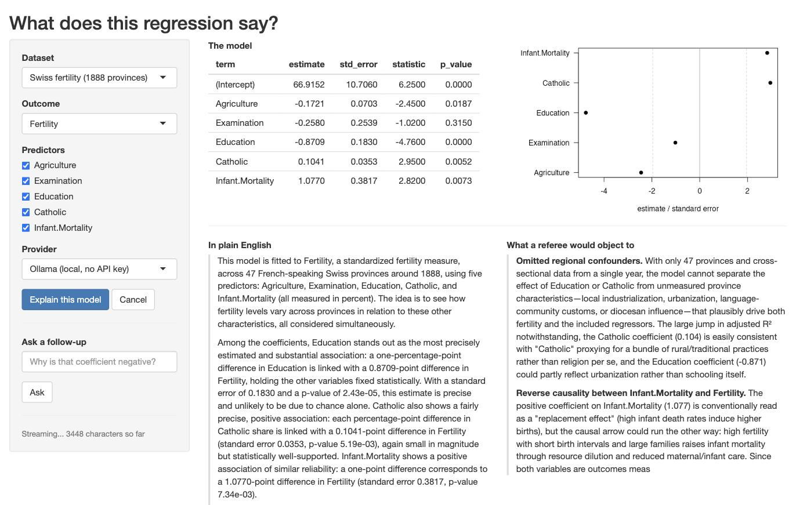

```{r, include = FALSE}
knitr::opts_chunk$set(
  collapse = TRUE
)
```

A Shiny app is a single R process that serves every connected user. R does one
thing at a time, so whenever your app is busy, it is busy for everybody: nobody's
buttons work, nobody's plots redraw. Work that occupies R this way is called
*blocking* work.

`chat()` is blocking work. It sends a prompt, then sits there until the model has
written its last word, which can easily be half a minute. Inside a Shiny app that
half minute freezes the whole app, for every connected user, not just the one who
pressed the button.

`send_chat()`, new in 0.6.0, is the verb that fits a Shiny app. It sends the
prompt and returns straight away, before the model has answered anything. The
answer arrives later, in small pieces, while your app carries on responding to
clicks.

This article walks through the patterns you need to turn that verb into a working
app. It assumes you have written a small Shiny app before, so that `ui`, `server`,
`observeEvent()` and `reactiveVal()` are familiar. It does *not* assume you have
ever written asynchronous code.

## Two Terms we will need

Two terms come up throughout, so it is worth pinning them down before any code.

**The event loop.** While your shiny app is waiting for something, an incoming 
click, atimer, a reply from a web server, R is not really idle. It sits in a loop that
repeatedly asks "has anything I am waiting for arrived yet?" and deals with
whatever has. That loop is the **event loop**, and it is what Shiny itself runs on:
it is how your app notices that a user pressed a button. `send_chat()` puts its
request into that same loop. Every time the loop comes around, a bit more of the
model's answer is read off the connection. This is why the app stays responsive:
your app and your model reply are taking turns in the same queue, instead of one
waiting for the other.

**A job, which is a handle.** `send_chat()` does not return an answer, because at
the moment it returns no answer exists yet. It returns a *job*, and a job is a
*handle*: an object that does not contain the thing you want, but that lets you
ask after it. Think of it like the recipe at dry cleaning shop. It is not your shirt, 
it tells you nothing about your shirt, and it stays exactly the same slip of paper whether
your shirt is still being cleaned up or it is ready to collect. What it does is let you
ask whether the shirt is ready and to collect it.

A job works the same way. It is not the model's answer, it does not grow as the
answer is written, and everything you do with a request in flight goes through
it:

| Function | What it does |
|---|---|
| `check_job(job)` | Returns the status: `"running"`, `"done"`, `"error"` or `"cancelled"` |
| `get_partial(job)` | Returns the text received so far |
| `fetch_job(job)` | Waits for the finished `LLMMessage` and returns it |
| `cancel_job(job)` | Stops the request and closes the connection |

That the job never changes has a practical consequence in Shiny, and it is the
first pattern below: the answer belongs in a `reactiveVal`, and the job does not.

## The Example App

The article follows a complete app that ships with the package. You can start it
with:

```{r run_app, eval = FALSE}
library(tidyllm)

tidyllm_example_app("model_explainer")
```

```{r screenshot, echo = FALSE, out.width = "100%", fig.alt = "Screenshot of the model explainer app: a coefficient table and precision plot on top, with two panels below streaming an explanation and a referee's objections side by side."}

```

The screenshot shows what it does. The app fits an ordinary linear regression to
a small public dataset. Along the top are the results R computed: the table of
coefficients and a plot of their confidence intervals. Underneath are two panels
that fill with text as the model writes it. The left panel is a plain English
explanation of what the coefficients mean. The right panel is a second, separate
request to the same model, asked to play a sceptical journal referee and list
objections to the regression. Those two panels are two independent jobs running
side by side, which is why the app is a useful tour: it has to keep two streams
of text moving while its own buttons still work.

The app defaults to a local `ollama()` model, so it runs with no API key and no
spend, and a dropdown switches it to Claude, OpenAI or Gemini. Its source is a
single file. To find out where it landed on your machine, run
`system.file("examples", "model_explainer", "app.R", package = "tidyllm")`.

## The Shortest Streaming App

Everything else in this article is a refinement of the thirty lines below. Two
arguments to `send_chat()` do the work. `.stream = TRUE` asks the provider to
send the answer in pieces as it is written, rather than in one block at the end.
`.on_chunk` is a function you supply that tidyllm calls once for every piece that
arrives. Those pieces are conventionally called *deltas*, because each one is
only the new text since the last call, not the answer so far.

So the whole trick is: every time a delta arrives, glue it onto the end of a
`reactiveVal`. Writing to a `reactiveVal` is all Shiny needs in order to redraw
the output, so the text appears on screen word by word.

```{r minimal, eval = FALSE}
library(shiny)
library(tidyllm)

ui <- fluidPage(
  textInput("prompt", "Ask something", width = "100%"),
  actionButton("go", "Send"),
  tags$div(style = "white-space: pre-wrap;", textOutput("reply"))
)

server <- function(input, output, session) {
  reply <- reactiveVal("")   # the text on screen
  job   <- NULL              # the ticket for the running request

  observeEvent(input$go, {
    reply("")
    job <<- llm_message(input$prompt) |>
      send_chat(
        ollama(),
        .stream   = TRUE,
        .on_chunk = function(delta) reply(paste0(isolate(reply()), delta))
      )
  })

  session$onSessionEnded(function() {
    if (!is.null(job) && check_job(job) == "running") cancel_job(job)
  })

  output$reply <- renderText(reply())
}

shinyApp(ui, server)
```

Four small things in there deserve a sentence each, because they are the kind of
detail that is easy to copy without understanding and hard to debug later.

The output is wrapped in `tags$div(style = "white-space: pre-wrap;", ...)` because
the model's answer contains line breaks, and HTML collapses those by default. The
wrapper is what stops a nicely paragraphed answer from arriving on screen as one
long run-on line.

`job <<- ...` uses the double arrow rather than the usual `<-` because `job` was
created outside the `observeEvent()` block. A plain `<-` inside the block would
create a *new* `job` visible only inside it, leaving the outer one `NULL` forever.

`isolate()` wraps the read of `reply()` inside `.on_chunk`. Normally, reading a
reactive value inside reactive code tells Shiny "re-run me whenever this value
changes". Here that would be circular, because this very line is what changes it.
`isolate()` means "let me read the current value without signing up for
notifications about it", which is what you want whenever you append to a
`reactiveVal` by reading its own old value.

`session$onSessionEnded()` registers a function to run when the user closes the
browser tab. Cancelling the job there matters enough to have its own section
below.

Finally, `job` is kept in an ordinary variable rather than in `reactiveValues()`.
That is deliberate, and it is the first pattern worth stating properly.

## Pattern: Keep the Job Plain, Keep the Text Reactive

Reactive machinery exists to redraw the screen when a value changes. A job never
changes, so putting one in a `reactiveVal` buys you nothing. The text does
change, and that is what your outputs should watch.

With one job you can use a plain variable, as the app above does. With two or
more it is tidier to keep them together, and the example app uses an environment
for that:

```{r jobs_env, eval = FALSE}
server <- function(input, output, session) {
  jobs <- new.env(parent = emptyenv())
  jobs$plain <- NULL           # the plain-English job
  jobs$referee <- NULL         # the sceptical-referee job

  plain_text <- reactiveVal("")
  # ...
}
```

Why does it use an environment rather than a list? Because when you pass
an ordinary R object such as a list into a function, R hands over a copy, so
changes made elsewhere never appear in yours. Environments are the exception:
there is only ever one of them, and everyone who holds it sees the same thing.
tidyllm writes into a job long after the observer that created it has returned,
so a list would leave you holding a snapshot of a job that has since moved on.
(`parent = emptyenv()` is tidiness: it stops a lookup that finds nothing here
from wandering off and picking up a variable of the same name elsewhere in your
app.)

## Pattern: Poll for Status, Push for Text

`.on_chunk` tells you about text, and only about text. If the request fails, no
delta arrives, so `.on_chunk` is never called and your UI would sit there looking
as if nothing had happened. Errors, completion, and anything else you want to put
in a status line have to be asked for rather than waited for.

An observer that re-runs itself every 400 milliseconds covers all of it.
`invalidateLater()` is the Shiny function that schedules that repetition, and
`check_job()` is cheap enough to call several times a second:

```{r status, eval = FALSE}
status_text <- reactiveVal("")   # drives a status line somewhere in the UI

observe({
  invalidateLater(400, session)
  if (is.null(jobs$plain)) return()

  switch(
    check_job(jobs$plain),
    running   = status_text(paste0(nchar(isolate(plain_text())), " characters so far")),
    done      = status_text("Done."),
    error     = status_text("The request failed. See the R console."),
    cancelled = status_text("Cancelled.")
  )
})
```

This observer has a second, less obvious job. Each of `check_job()`,
`get_partial()` and `fetch_job()` gives the event loop a turn while it runs, so
asking about a job is also what nudges it along. In a session where the user is
doing nothing at all, this ticking observer is what keeps the reply flowing.

## Pattern: Cancel, and Clean Up After the Tab Closes

`cancel_job()` closes the connection to the provider and marks the job cancelled.
Wire it to a button so the user can stop a long answer. Then wire it a second
time to the end of the session, because a user who simply closes the browser tab
halfway through leaves a connection open and, on a paid provider, tokens being
billed for text nobody will ever read.

```{r cancel, eval = FALSE}
stop_jobs <- function() {
  for (nm in c("plain", "referee")) {
    job <- jobs[[nm]]
    if (!is.null(job) && check_job(job) == "running") cancel_job(job)
  }
}

observeEvent(input$cancel, {
  stop_jobs()
  status_text("Cancelled.")
})

session$onSessionEnded(stop_jobs)
```

> ⚠️ **Note:** A cancelled job cannot be fetched afterwards. Calling
> `fetch_job()` on one throws an error rather than waiting forever for an answer
> that will never come, so check `check_job()` first if there is any chance the
> job was cancelled.

## Pattern: Multi-Turn With an Immutable Message

Other packages give you a chat object that remembers the conversation and that you
add to as you go. tidyllm does not work that way. An `LLMMessage` never changes
once it has been created; a new turn in a conversation is a *new* message made of
the old conversation plus one more line. Nothing is modified in place.

That suits Shiny well, because it means a conversation is just another value you
can store in a variable. To ask a follow-up question: fetch the finished message,
append the new question to it, and send the result.

Note that `llm_message()` does double duty here. Given a string it starts a fresh
conversation, which is how every earlier example used it. Given an existing
`LLMMessage`, as below, it returns a *new* message consisting of that
conversation plus your text as the next turn.

```{r followup, eval = FALSE}
observeEvent(input$ask, {
  req(nzchar(input$followup), !is.null(jobs$plain))
  if (check_job(jobs$plain) != "done") return()

  conversation <- fetch_job(jobs$plain) |> llm_message(input$followup)

  jobs$plain <- send_chat(
    conversation, claude(), .stream = TRUE,
    .on_chunk = function(delta) plain_text(paste0(isolate(plain_text()), delta))
  )
})
```

(`req()` in there is Shiny's quiet guard: it abandons the observer unless every
condition given to it is true, which saves a nest of `if` statements.)

Because the previous message is still a perfectly good value, features that sound
ambitious turn out to be nearly free. Letting the user rewind one turn, or branch
a conversation in two directions, costs you nothing more than keeping the older
message in a second variable.

## Pattern: A Provider Dropdown

Letting the user pick between providers is the cheapest feature in the app and
the most convincing one: the same code path, four different APIs.

There is one wrinkle. The provider argument to `send_chat()` is a function call,
`claude()` or `ollama()`, and you do not want those calls to happen when the app
starts up, because building a provider reads API keys and settings that may only
matter for the option the user actually picks. So the app stores the calls
*unevaluated*, using `quote()`, and runs the chosen one with `eval()` at the
moment the button is pressed. `quote(claude())` means "the instruction to call
`claude()`" rather than the result of calling it.

Each entry also carries a `concurrent` flag, which the next section explains:

```{r providers, eval = FALSE}
PROVIDERS <- list(
  "Ollama (local, no API key)" = list(call = quote(ollama(.model = "qwen3.5:4b")),
                                      concurrent = FALSE),
  "Claude"                     = list(call = quote(claude()),
                                      concurrent = TRUE),
  "OpenAI"                     = list(call = quote(openai(.model = "gpt-5.6-luna")),
                                      concurrent = TRUE),
  "Gemini"                     = list(call = quote(gemini()),
                                      concurrent = TRUE)
)

# in the UI
selectInput("provider", "Provider", names(PROVIDERS))

# in the server
provider <- PROVIDERS[[input$provider]]
job <- send_chat(conversation, eval(provider$call), .stream = TRUE)
```

## Pattern: Two Jobs at Once, With One Limitation

Several jobs really do run at the same time. The example app streams its two
panels from two separate jobs, and against a cloud provider they fill in
together.

When R sends a request, the server first sends back a short preamble describing the response (the *headers*), and only then the body, which for a streaming reply trickles in piece by piece. A streaming
`send_chat()` returns as soon as those headers arrive, which is normally within a
second.

A server that only handles one request at a time, which is what a stock Ollama
install is, will not send headers for your second request until the first request
has completely finished. So the second `send_chat()` sits there blocking, and
while it blocks, nothing is running the event loop, which means nothing is
collecting the first stream either. Both panels stall. Against `claude()` or
`openai()`, which handle many requests at once, both calls return promptly and
the two streams interleave properly.

That is what the `concurrent` flag in the provider list records. When the
provider can take both requests, the app sends both immediately; when it cannot,
it stores the second prompt and lets the status observer start it once the first
job is done:

```{r concurrency, eval = FALSE}
if (isTRUE(provider$concurrent)) {
  start_referee()                       # a helper in the app, not a tidyllm verb
} else {
  jobs$referee_prompt <- referee_prompt # the status observer starts it later
}
```

You can also fix the local case at the source. Ollama reads an environment
variable that tells it how many requests to serve at once, so setting
`OLLAMA_NUM_PARALLEL=2` in your shell before starting the Ollama server makes the
local path behave like the cloud one.

## Pattern: R Computes, the Model Narrates

This last pattern is about trust rather than plumbing, and it is the reason the
example app is a regression explainer rather than a chatbot. Language models are
unreliable at arithmetic and quite willing to invent a plausible-looking number.
So the app never asks the model to compute anything. Every number the model sees
has been computed by R and pasted into the prompt verbatim, together with an
instruction never to state a number that is not in the table:

```{r narrate, eval = FALSE}
model_as_markdown <- function(fit) {
  tab <- coef_table(fit)   # from summary(fit)$coefficients
  # ... markdown table, observations, R-squared ...
}

prompt_plain <- function(fit, context) {
  llm_message(paste(
    "You explain regression output to someone who knows a little statistics.",
    "\n\nData:", context,
    "\n\n", model_as_markdown(fit),
    "\n\nUse only the numbers in the table above. Never state a number that is",
    "not there, and never describe a coefficient as an effect of one variable",
    "on another; these are associations."
  ))
}
```

The model is left doing the part it is genuinely good at, turning a table into
readable sentences, and none of the part it is bad at.

> ⚠️ **Note:** One trap while assembling such a prompt. For a long formula,
> `deparse()` returns a character *vector* of several strings rather than one
> string, and `paste()` works element by element on vectors. So
> `paste("Model:", deparse(formula(fit)))` silently produces two mangled copies
> of your prompt instead of one good one. Collapse it first:
> `paste(deparse(formula(fit)), collapse = " ")`.

## What to Watch Out For

- **Your own blocking calls pause every job.** Because tidyllm collects replies on
  the event loop, anything that occupies R for a while stops all streaming for
  its duration: a `Sys.sleep()`, a long `read.csv()`, or a blocking `chat()`
  somewhere else in the app.
- **Tool calls block.** If you give a job `.tools` so the model can call R
  functions, the session pauses while those functions run and their results are
  sent back.
- **No structured output while streaming** on `claude()` and `openrouter()`. If
  you need `.json_schema` to get a strictly shaped answer back, send that job with
  `.stream = FALSE`. It still runs without blocking; you simply get the answer in
  one piece at the end rather than word by word.
- **A streamed job is not retried automatically.** If the provider replies with
  HTTP status 429, its way of saying "you are sending too fast, slow down", the
  job fails. Show the error in the UI and let the user press the button again.


## If You Already Use shinychat or ExtendedTask

Nothing above needs any package beyond shiny and tidyllm. If you already work
with the wider asynchronous tooling in R, though, a tidyllm job fits into it.

`get_stream()` turns a job into a stream of deltas of the kind that
`shinychat::chat_append()` knows how to consume, so a chat UI is two lines:

```{r shinychat, eval = FALSE}
job <- llm_message(input$prompt) |> send_chat(claude(), .stream = TRUE)
shinychat::chat_append("chat", get_stream(job))
```

A job can also be converted into a *promise*, the standard R object representing
a value that will exist later. That is what Shiny's `ExtendedTask` expects, so
non-streaming work drops straight in:

```{r extended, eval = FALSE}
task <- ExtendedTask$new(function(prompt) {
  promises::as.promise(send_chat(llm_message(prompt), openai(), .stream = FALSE))
})
```

Both routes are optional conveniences. `.on_chunk` writing into a `reactiveVal`
needs neither package.

## The Same Machinery Outside Shiny

`send_chat()` is also useful outside of shiny. In a plain script it is the fire-and-collect
verb: dispatch a request, get on with something else, collect the answer when you
need it. `check_job()` reports the status, `get_partial()` gives the text so far,
and `fetch_job()` waits for the finished `LLMMessage`. Note that `fetch_job()`
waits by running the event loop rather than by sleeping, so anything else you
have in flight keeps making progress while it waits.

```{r script, eval = FALSE}
job <- llm_message("Summarise this 400-page report") |>
  send_chat(claude(), .stream = TRUE)

other_work()                      # runs while the reply arrives

reply <- fetch_job(job)           # the LLMMessage chat() would have returned
```

If your problem is many prompts rather than one slow prompt, `parallel_chat()` is
the better verb. It takes a list of messages, runs them against one provider with
a cap on how many go at once, and returns a tibble alongside the replies, which
is the shape the rest of a data pipeline wants. And when the answers can wait
overnight, `send_batch()` remains the cheapest option of all.

## Where to Go Next

Read the example app from top to bottom. It is a single file, and every pattern
above appears in it in context.
